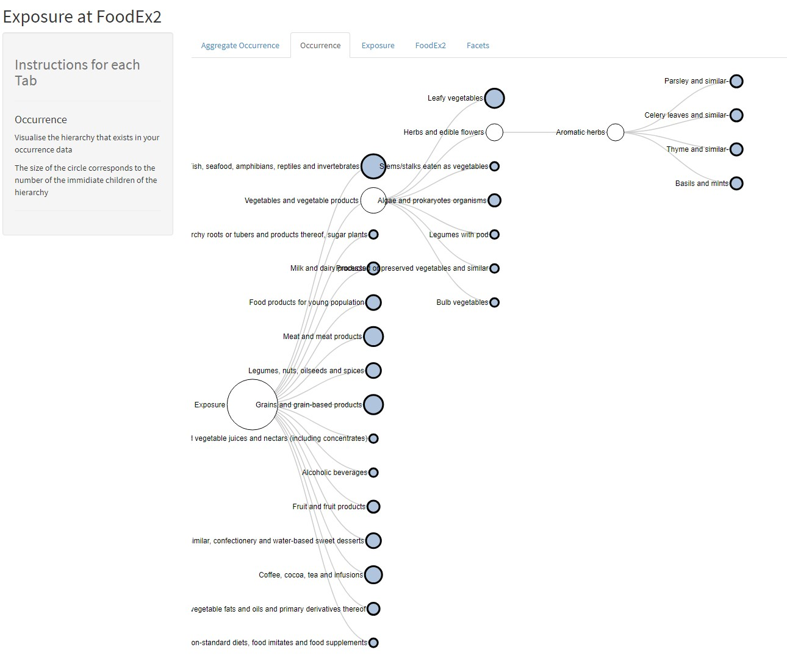
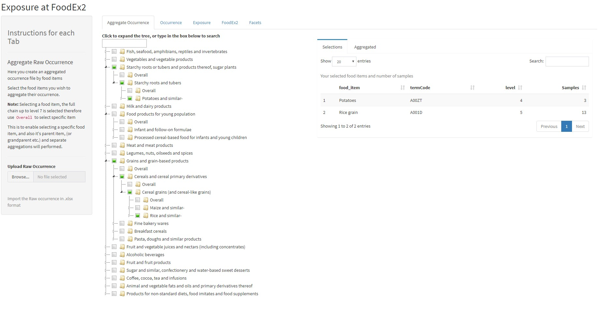

# FoodEx2 shiny

<!-- badges: start -->
<!-- badges: end -->

The goal of FoodEx2 shiny is to conduct dietary risk assessment according to the [FoodEx2](https://www.efsa.europa.eu/en/data/data-standardisation) classification system.

This is a work in progress

See the app in [shinyapps](https://sglcy.shinyapps.io/foodex2/)

